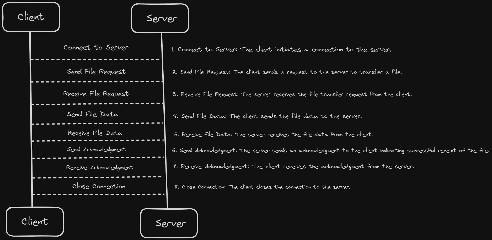

# TCP File Transfer Application

- [Overview](#overview)
- [Structure](#structure)
- [How it's works](#how-its-works)
- [Features](#features)
- [Run the Application](#run-the-application)
- [Implementation functionality in the feature](#implementation-functionality-in-the-feature)

## Overview

This project is a TCP-based file transfer application that allows clients to connect to a server and transfer files.



This diagram represents a single file transfer session. In the future, I am gonna implement multiple clients and file transfers concurrently, using threading or asynchronous I/O.

## How it's works

Server Side

1. **Initialization:**

    - **Directory Setup:**

        1. The server begins by ensuring that the necessary directories are in place.
        2. `send_file` **Directory:** This directory contains the files that the server is prepared to send to clients. It acts as a repository of files that can be requested by clients. This directory appears in the root directory and also in the `build` folder.
        3. `received_file` **Directory:** This directory is used to store files that are sent by clients to the server. It ensures that all incoming files are organized and stored in a specific location. This directory appears in the root directory and also in the `build` folder.

    - **Signal Handling:**

        1. The server sets up a signal handler to manage the SIGINT signal, which is typically generated when the user presses Ctrl+C in the terminal.
        2. Graceful Shutdown: When the server receives a SIGINT signal, the signal handler is triggered. This handler performs the following actions:

            - Logs a message indicating that the server is shutting down.
            - Closes the server `socket to ensure that no new connections are accepted and that existing connections are properly terminated.
            - Cleans up any resources that were allocated during the server's operation (network resources on Windows using `WSACleanup` - is a function used in Windows network programming to clean up resources allocated by the Winsock library to prevent memory leaks).
            - Exits the program, ensuring that all necessary cleanup operations are performed.

2. **Server Setup:**

    - **Socket Creation:**

        - The server begins by creating a socket, which is an endpoint for communication. A socket is a combination of an IP address and a port number.

        - **Function Used with parameters:** `socket()`
            - `AF_INET`: Specifies the address family (IPv4).
            - `SOCK_STREAM`: Specifies the socket type (stream socket for TCP).
            - `0`: Specifies the protocol (default protocol for the specified address family and socket type).

    - **Binding the Socket:**

        - After creating the socket, the server binds it to a specific IP address and port number. This step associates the socket with a particular network interface and port on the server machine.
        - **Function Used with parameters:** `bind()`
            - `sockfd`: The file descriptor of the socket to bind.
            - `struct sockaddr *addr`: A pointer to a `sockaddr` structure that contains the address to bind to.
            - `addrlen`: The size of the address structure.

    - **Listening for Connections:**

        - Once the socket is bound to an address, the server puts the socket into listening mode. This means the server is ready to accept incoming connection requests from clients.
        - **Function Used and parameters:** `listen()`
            - `sockfd`: The file descriptor of the socket to listen on.
            - `backlog`: The maximum number of pending connections that can be queued.

3. **Client Connection:**

    - **Accepting Client Connections:**

        - When a client attempts to connect to the server, the server accepts the connection. This step creates a new socket for the connection.
        - **Function Used and parameters**: `accept()`
            - `sockfd`: The file descriptor of the listening socket.
            - `struct sockaddr *addr`: A pointer to a `sockaddr` structure that will be filled with the address of the connecting client.
            - `addrlen`: A pointer to a variable that will be filled with the size of the address structure.

    - **Receiving the File Name:**

        - Once the connection is established, the server waits for the client to send the name of the file that it wants to transfer. This is typically done by reading data from the client socket.
        - **Function Used and parameters:** `recv()`
            - `sockfd`: The file descriptor of the client socket.
            - `buf`: A buffer to store the received data.
            - `len`: The length of the buffer.
            - `flags`: Flags to modify the behavior of the `recv` function.

    - **File Transfer:**

        - After receiving the file name, the server prepares to receive the actual file data from the client. The server reads the file data from the client socket and writes it to a file in the `received_file` directory.
        - **Function Used:** `recv()` (for receiving file data) and file I/O functions (`fopen`, `fwrite`, `fclose`) for writing the data to a file.

    - **Closing the Connection:**

        - Once the file transfer is complete, the server closes the client socket to terminate the connection.
        - **Function Used:** `close()` (or `closesocket()` on Windows)

Client Side

1. **Client Side Initialization:**

    - **Loading Network Libraries:**

        - On Windows, the client needs to initialize the Winsock library before any network operations can be performed. This is done using the `WSAStartup` function.
        - **Function Used and Parameters:** `WSAStartup()`
            - `wVersionRequested:` The version of Winsock to use. Typically, `MAKEWORD(2, 2)` is used to request version 2.2.
            - `lpWSAData:` A pointer to a `WSADATA` structure that receives details of the Windows Sockets implementation.

## Structure

- `include/`: Contains header files for the project.
- `src/`: Contains the source code files for the project.
- `build/`: Directory where compiled binaries are stored.
- `logs/`: Directory where log files are stored.

## Features

- **File Transfer:** Allows sending and receiving files between a client and a server.
- **Logging:** Logs important events and errors to a log file in the root directory.
- **Error Handling:** Basic error handling for file transfer and logging operations.
- **Connection Handling:** Manages individual client connections and handles the logic for receiving and sending files.
- **Client Handling:** Manages client-side operations, initiates connections to the server, and requests file transfers.

## Run the Application

1. **Clone the Repository:**

    ```bash
    git clone <repository-url>
    cd <repository-directory>
    ```

2. **Build the Application:**

    1. Compile the Application:

        - Create `logs` and `build` directories if they don't exist.
        - Remove existing `logs` and `build` directories if they do exist.
        - Compile the server and client programs, placing the executables in the `build` directory.

        ```bash
        ./compile.sh
        ```

    2. Run the Server:

        - Start the server executable (`build/server`).
        - In `build` folder there should be created two folders `received_files` and `send_files`

        ```bash
        ./run_server.sh
        ```

    3. Manually Create Example File:

        - Create a file named `example.txt` in the `send_files` directory.

    4. Run the Client:

        - Start the client executable (`build/client`) with the specified server IP (IPv4) and file to transfer.

        ```bash
        ./run_client.sh <server-ip> <file-to-transfer>
        ```

## Implementation functionality in the feature

1. **Authentication**: Ensure only authorized users can transfer files.
2. **Encryption**: Encrypt file transfers to ensure data privacy and security.
3. **File Integrity**: Verify the integrity of transferred files using checksums or hashes.
4. **Concurrency**: Support multiple concurrent file transfers using threading or asynchronous I/O.
5. **User Interface**: Develop a command-line or graphical user interface for ease of use.
